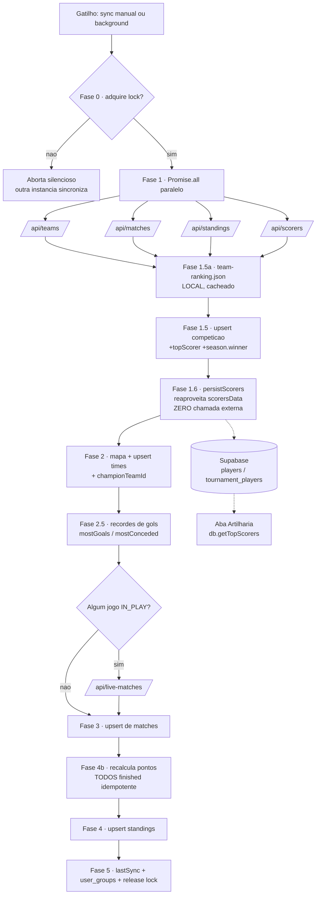

# Chamadas Externas + Fluxo Supabase — Especificação

> **Escopo deste documento (specs).** Descreve, de forma normativa:
> 1. **Todas** as chamadas a serviços externos (foco na **Football-Data.org**);
> 2. **Quando** o app **lê** do Supabase e **quando escreve** nele;
> 3. O **pipeline de sync** fase a fase (fonte da verdade: `hooks/useSyncSystem.ts`);
> 4. Uma **análise de melhoria** — quais chamadas parecem redundantes e como reduzi-las.

> **TL;DR.** Cada execução de `syncMatchesAndStandings` faz **4 chamadas externas
> em paralelo** (`teams`, `matches`, `standings`, `scorers`) **+ 1 condicional**
> (`live-matches`, só com jogo ao vivo) **+ 1 local** (`team-ranking.json`, em
> cache). A partir desses 4 payloads, o pipeline faz **vários writes no Supabase**
> (competição, times, artilheiros, jogos, classificação, prêmios) e nenhuma
> chamada externa extra. As demais leituras do app (boot, polling 15 s, Realtime)
> **não tocam a API externa** — só o Supabase.

---

## 1. Arquitetura do proxy (o token nunca vai ao frontend)

Toda chamada à Football-Data passa por um caminho `/api/*` que injeta o header
`X-Auth-Token` **no servidor**. O token (`FOOTBALL_DATA_TOKEN`) nunca é exposto
ao browser, e o proxy também resolve CORS.

Há **duas implementações do mesmo contrato** `/api/*`, conforme o ambiente:

| Ambiente | Quem serve `/api/*` | Onde |
|----------|--------------------|------|
| **Dev** (`vite`) | Proxy do Vite — reescreve `/api/x` → `https://api.football-data.org/v4/...` e injeta o token | `vite.config.ts` |
| **Produção** (Vercel) | Vercel Edge Functions (uma por endpoint) | `api/*.ts` |

Regra de ouro (ver `docs/conventions`): **o frontend nunca chama
`api.football-data.org` direto** — sempre `fetch('/api/...')` via
`services/liveScoreService.ts`.

```
Componente / Hook
      │  fetch('/api/scorers?competition=WC&season=2026')
      ▼
services/liveScoreService.ts   (fetchCompetitionScorers, etc.)
      │
      ▼
/api/*  ──► [DEV] Vite proxy            ──┐
         └► [PROD] Vercel Edge Function ──┤  injeta X-Auth-Token
                                          ▼
                       https://api.football-data.org/v4/...
```

---

## 2. Catálogo de endpoints externos (Football-Data)

Os endpoints com `season` seguem o padrão **"tenta com `season`, faz fallback
sem `season`"** em `404/403` (a temporada do ano corrente pode não existir ainda
na API). `getCurrentSeason()` = ano atual (`new Date().getFullYear()`).

| Caminho frontend | Endpoint Football-Data (`/v4`) | Função em `liveScoreService.ts` | Para quê |
|---|---|---|---|
| `/api/teams` | `GET /competitions/{code}/teams` | `fetchCompetitionTeams` | Times + **elencos** (squad → tabela `players`) |
| `/api/matches` | `GET /competitions/{code}/matches` | `fetchExternalMatches` | Jogos, placares, status, fases, `season.winner` |
| `/api/standings` | `GET /competitions/{code}/standings` | `fetchExternalStandings` | Classificação (tabela de grupos) |
| `/api/scorers` | `GET /competitions/{code}/scorers` | `fetchCompetitionScorers` | **Artilheiros** (gols/assist/pênaltis) |
| `/api/live-matches` | `GET /matches?status=IN_PLAY` | `fetchLiveMatchMinutes` | **Minuto** dos jogos ao vivo (único endpoint que traz `minute`) |
| `/api/competitions` | `GET /competitions` | `fetchExternalCompetitions` | Lista de competições (setup admin) |

> **Não é chamada de rede externa:** `data/team-ranking.json` é um arquivo
> **estático bundlado**, lido por `getWcRankingMap` (`hooks/useMatchSystem.ts`)
> via `fetch` de URL **local** e **cacheado em ref** após a 1ª leitura. Custa
> **zero** requisições à Football-Data.

---

## 3. Matriz de gatilhos — quando cada endpoint externo é chamado

| Gatilho | Quem dispara | Endpoints externos chamados |
|---|---|---|
| **Sync manual** (botão "Sincronizar" / Admin) | Admin | `teams` + `matches` + `standings` + `scorers` (paralelo) e `live-matches` (se houver jogo ao vivo) |
| **Sync automático / background** | Qualquer usuário logado (via `useBackgroundSync`, intervalo `sync_interval_ms`, default 5 min) | Idêntico ao manual |
| **Bootstrap de competição** (criar grupo de uma competição nova) | Admin | Idêntico ao sync (chama `syncMatchesAndStandings`) |
| **"Sync Players"** (botão Admin → `syncSquads`) | Admin | Apenas `teams` (elencos → `players` + `tournament_players`) |
| **"Sync Scorers"** (botão Admin → `syncScorers`) | Admin | Apenas `scorers` |
| **Carregar lista de competições** (tela admin) | Admin | `competitions` |
| **Polling de UI** (`usePollingRefresh`, 15 s) | Usuário logado | **Nenhuma chamada externa** — apenas `refetch` do Supabase |
| **Boot / Realtime** | Qualquer usuário | **Nenhuma chamada externa** — apenas Supabase |

> **Importante:** `usePollingRefresh` (15 s) **não** chama a API externa — ele só
> relê o Supabase. Quem chama a Football-Data é o **background sync**
> (`useBackgroundSync`), no intervalo `sync_interval_ms` (default **5 min**) e
> somente quando o `lastSync` da competição já expirou. O background sync roda
> **para qualquer usuário logado**, mas um **lock distribuído** no banco garante
> que só **um cliente** sincroniza por vez (ver §5.1).

### Onde fica cada gatilho no código

- `hooks/useSyncSystem.ts` → `syncMatchesAndStandings` (pipeline principal)
- `hooks/useBackgroundSync.ts` → agenda o sync passivo (gating por tempo + lock)
- `hooks/usePollingRefresh.ts` → refetch do Supabase a cada 15 s (sem API externa)
- `hooks/usePlayerSync.ts` → `syncSquads` (elencos) e `syncScorers` (manual)
- `components/AdminDashboard.tsx` → botões manuais + `fetchExternalCompetitions` + `syncTeamRankings`

---

## 4. Pipeline de sync — `syncMatchesAndStandings(code)` fase a fase

Esta é a **especificação normativa** da ordem das fases. Cada fase indica se faz
**chamada externa (EXT)**, **escrita Supabase (W)** ou **leitura Supabase (R)**.

| Fase | O quê | EXT | Supabase |
|---|---|:---:|---|
| **0 · Guards + Lock** | Checa permissão (`canWriteData` OU `isBackgroundSync`); adquire lock distribuído | — | **R/W** `acquire_sync_lock` (RPC) |
| **1 · Fetch paralelo** | `Promise.all` de `teams`, `matches`, `standings`, `scorers` | **4×** | — |
| **1.5a · Ranking map** | `getWcRankingMap()` lê `team-ranking.json` (local, cacheado) | — (local) | — |
| **1.5 · Upsert competição** | Grava metadados + `topScorerName/Goals`; deriva `season.winner` (campeão, aplicado na Fase 2) | — | **W** `competitions` |
| **1.6 · Persistir artilheiros** | `persistScorers(code, scorersData)` — **reaproveita** o `scorersData` da Fase 1 | — | **W** `players` + `tournament_players` |
| **2 · Mapa de times** | Constrói mapa ext→interno; adota órfãos; upsert de times novos/atualizados; resolve `championTeamId` e grava | — | **W** `teams`, `competitions` |
| **2.5 · Recordes de gols** | Varre jogos `FINISHED` p/ "time com mais gols" e "mais gols sofridos" em **um** jogo | — | **W** `competitions` (`mostGoalsTeamId`, `mostConcededTeamId`) |
| **3 · Diff de jogos** | Compara API vs banco; busca minuto **só se** há jogo `IN_PLAY/PAUSED`; upsert dos que mudaram | **0–1** `live-matches` | **W** `matches` |
| **3.5 · Live details** (api-sports) | Minuto-a-minuto **cosmético**: relógio, eventos, árbitro, estádio. Só com jogo ao vivo + gate de throttle (`liveDetailsLastSync`, default 50s) dentro do lock principal | **0–1** `live-details` | **R/W** `competitions.liveDetailsLastSync` + **W** `matches.liveDetails` |
| **4b · Pontos** | `batchProcessPointsForMatches` — recalcula pontos de **todos** os jogos `FINISHED` (idempotente) | — | **R/W** `predictions` |
| **4 · Standings** | Upsert da classificação (dedup por `teamId|competitionCode`) | — | **W** `team_standings` |
| **5 · Fechamento** | Atualiza `lastSync`; recalcula `user_groups`; libera lock | — | **W** `competitions`, `user_groups`; **W** release lock |

> **Total externo por sync:** **4** (sempre, Football-Data) **+ 1** (`live-matches`,
> só com jogo ao vivo) **+ 1** (`live-details` da api-sports, só com jogo ao vivo e
> throttle expirado). As fases 1.5, 1.6, 2, 2.5, 4 e 4b **não fazem nenhuma chamada
> externa** — todas derivam dos 4 payloads já buscados na Fase 1.

### Detalhes que mudaram em relação à versão anterior do doc

- **Fase 1.5 agora também deriva o campeão** (`season.winner`, um `externalTeamId`).
  O `championTeamId` (UUID) só é resolvido na **Fase 2**, depois que o mapa de
  times ganha os UUIDs reais, e então gravado em `competitions`.
- **Fase 2.5 é nova:** calcula, a partir dos jogos finalizados já em memória, o
  time que **fez mais gols** e o que **sofreu mais gols** num único jogo, e grava
  em `competitions.mostGoalsTeamId` / `mostConcededTeamId` (prêmios/curiosidades).
- **Fase 4b processa TODOS os jogos `FINISHED`** do banco local — não só os que
  mudaram neste sync. Garante pontos corretos mesmo se um sync anterior falhou
  no cálculo. É idempotente (só faz `upsert` se `prediction.points` mudou).

### Fluxo (Mermaid)



---

## 5. Fluxo de dados com o Supabase — quando lê, quando escreve

A API externa é **fonte de verdade dos resultados**; o **Supabase é a fonte de
verdade do app**. O frontend quase nunca lê da API externa diretamente — ele lê
do Supabase, que é alimentado pelo pipeline de sync.

### 5.1 Quando o app ESCREVE no Supabase

| Quando | Tabelas escritas | Origem |
|---|---|---|
| **Durante o sync** (admin ou background) | `competitions`, `teams`, `players`, `tournament_players`, `matches`, `team_standings`, `predictions` (pontos), `user_groups` | `useSyncSystem` (ver §4) |
| **Lock de sync** | `competitions.sync_locked_at` (via RPC `acquire_sync_lock` + update no release) | Fase 0 / Fase 5 |
| **"Sync Players" / "Sync Scorers"** | `players`, `tournament_players` | `usePlayerSync.syncSquads/syncScorers` |
| **Ação do usuário** | `predictions`, `tournament_predictions`, `extra_phase_predictions` | Salvar palpite |
| **Ações de admin** | `groups`, `user_groups`, `user_roles`, `system_config`, edições manuais de `matches` | `AdminDashboard` |

> **Gating de escrita do sync:** admins escrevem sempre (`canWriteData`); usuários
> comuns escrevem via **background sync** apoiados no **RLS** (migration `0020`
> permite `INSERT/UPDATE` de `players`/`tournament_players` a qualquer
> `authenticated`; matches/standings idem conforme RLS).

### 5.2 Quando o app LÊ do Supabase

| Quando | O que lê | Onde |
|---|---|---|
| **Boot** (carga inicial) | `Promise.all` de ~12 tabelas: `user_roles`, `teams`, `stadiums`, `groups`, `user_groups`, `matches`, `predictions`, `tournament_predictions`, `system_config`, `competitions`, `team_standings`, `extra_phase_predictions` | `DatabaseContext` (carga inicial) |
| **Polling 15 s** | `refetchMatches`; **se** placar/status mudou → `refetchPredictions` + `refetchUserGroups` (após 2 s) | `usePollingRefresh` |
| **Realtime (push)** | Eventos `postgres_changes` em 9 tabelas: `matches`, `predictions`, `tournament_predictions`, `extra_phase_predictions`, `user_roles`, `groups`, `user_groups`, `system_config`, `competitions` | `DatabaseContext` (canal `db-realtime-changes`) |
| **Aba Artilharia** | `getTopScorers(code)` → `tournament_players` + `players` | `usePlayerSync` |
| **Busca de jogador** | `searchPlayers` / `getPlayersByIds` → `players` + `tournament_players` | `usePlayerSync` |

> **Leitura ≠ API externa.** Boot, polling e Realtime tocam **apenas** o Supabase.
> A única forma de o app falar com a Football-Data é o **sync** (e os botões
> manuais de admin). Se nenhum admin/usuário dispara sync, **nenhum** dado novo de
> resultado entra no sistema — limitação conhecida (ver `docs/features/sync-system.md`).

### 5.3 Ciclo completo de um resultado (da API ao ranking)

```
Football-Data /matches ──(sync, Fase 1)──► useSyncSystem
   │                                           │ Fase 3: upsert matches
   │                                           │ Fase 4b: recalc predictions.points
   │                                           │ Fase 5: recalc user_groups
   ▼                                           ▼
(API externa)                            Supabase (matches/predictions/user_groups)
                                               │
                          ┌────────────────────┼─────────────────────┐
                          ▼                     ▼                     ▼
                   Realtime push        Polling 15s (refetch)   Boot (Promise.all)
                          └─────────────► UI (ranking/placares) ◄────┘
```

---

## 6. Persistência de artilheiros (detalhe da Fase 1.6)

- `persistScorers(competitionCode, scorersData)` é função **de módulo** (não-hook)
  exportada de `hooks/usePlayerSync.ts`.
- Reutilizada por **dois** caminhos, sem duplicar a lógica de upsert:
  1. `useSyncSystem` (Fase 1.6) — usa o `scorersData` já buscado → **sem chamada extra**.
  2. `usePlayerSync.syncScorers` (botão manual) — aí sim chama `/api/scorers` ele mesmo.
- Escreve em `players` (`onConflict externalPlayerId`) e `tournament_players`
  (`onConflict playerId,competitionCode`).
- **Gating:** `canWriteData` (admin) **ou** `isBackgroundSync` (usuário comum,
  autorizado pelo RLS da migration `0020`).
- É **não-fatal**: envolto em `try/catch` — falha aqui não quebra o sync de
  jogos/classificação.

---

## 7. Rate limiting

- A Football-Data (plano free) limita requisições por minuto. `fetchExternalMatches`
  trata `429` lançando `RATE_LIMIT_<segundos>` (lê `retry-after` ou a mensagem).
- Como cada sync custa **4–5** chamadas, **reduzir a frequência/escopo** do
  background sync é a principal alavanca para evitar `429` (ver §9).
- `teams` e `scorers` mudam pouco minuto-a-minuto; são os melhores candidatos a
  uma cadência mais lenta que os placares.

---

## 8. Outras integrações externas (fora do sync)

| Serviço | Caminho | Quando | Observação |
|---|---|---|---|
| **Google Gemini** | `/api/gemini-prediction` | Previsões assistidas por IA | `services/geminiService.ts` |
| **Supabase Auth** | `/api/supabase-signup` | Cadastro de usuário | Proxy de signup (fallback p/ `supabase.auth.signUp`) |
| **Supabase** (DB/Realtime/Auth) | client SDK | Leituras/escritas e Realtime | `services/supabase.ts` — **não** é Football-Data |

### Minuto-a-minuto (api-football / api-sports) — JÁ CONECTADO

- `api/live-details.ts` — proxy para **api-sports** (`v3.football.api-sports.io`,
  `/fixtures?live=all&league=1`). **Conectado** à **FASE 3.5** do pipeline
  (`fetchLiveMatchDetails` → `matches.liveDetails`). Cosmético: relógio, eventos,
  árbitro, estádio — **não** entra em pontuação. Gateado por jogo ao vivo + um
  **gate de throttle simples** (`liveDetailsLastSync`, default **50s**) que roda
  **dentro** do lock principal do sync — **não** há lock atômico próprio (o
  `acquire_live_details_lock` da migration `0033` foi revertido em `5711779` e está
  órfão). **Fluxo completo documentado em `documentacao/sync-flow.md`.**
- `api/api-football-live.ts` — proxy **alternativo/legado** da mesma api-sports,
  **não** ligado ao pipeline. Mantido como referência.

---

## 9. Análise de melhoria — chamadas potencialmente redundantes

> Esta seção é **propositiva** (não descreve o estado atual). Objetivo: reduzir as
> 4 chamadas externas fixas por sync, que hoje disparam **mesmo quando nada mudou**.

### 9.1 Diagnóstico

O background sync hoje é gateado **só por tempo** (`sync_interval_ms`). A cada
janela ele dispara **as 4 chamadas em bloco**, independentemente de:
- haver jogo ao vivo ou prestes a começar/terminar;
- elencos/artilheiros terem mudado.

Resultado: a maior parte dos syncs (fora de dias de jogo) busca `teams`, `scorers`
e `standings` **sem nenhuma mudança real** — desperdício de cota e risco de `429`.

### 9.2 Oportunidades (ordenadas por custo/benefício)

| # | Chamada | Frequência atual | Observação | Proposta |
|---|---|---|---|---|
| 1 | `/api/teams` | Todo sync | Elenco/composição de times é praticamente **estático** durante o torneio; payload é o mais pesado (WC ≈ 1248 jogadores) | Buscar **só no bootstrap** e via botão "Sync Players". Remover da Fase 1 do sync recorrente. |
| 2 | `/api/scorers` | Todo sync | Só muda quando há **gol**. Fora de janela de jogo, é sempre idêntico | Gatear: só chamar se houve jogo `IN_PLAY/FINISHED` desde o último sync (ou cadência lenta, ex. 1×/30 min). |
| 3 | `/api/standings` | Todo sync | Em fase de grupos é **derivável** dos resultados que já buscamos em `/api/matches` | Avaliar derivar localmente (cuidado com critérios de desempate); ou cadência lenta. |
| 4 | `/api/matches` | Todo sync | É o **core** — placares/status. Deve continuar rápido | Manter na cadência rápida. |
| 5 | `/api/live-matches` | Condicional | Já é eficiente (só com jogo ao vivo) | Manter. |

### 9.3 Direção recomendada: **cadências desacopladas + gate por estado**

Em vez de "4 chamadas a cada N minutos", separar por volatilidade:

- **Rápido (core):** `matches` + `live-matches` (condicional) — no `sync_interval_ms` atual.
- **Lento/event-driven:** `scorers` (após jogo ao vivo/finalizado) e `standings`
  (cadência maior, ex. a cada X minutos ou pós-jogo).
- **Sob demanda:** `teams` (bootstrap + botão admin), **fora** do loop recorrente.

**Gate por estado** para pular o bloco pesado quando não há nada acontecendo:
se nenhum jogo está `IN_PLAY` e nenhum começa/termina dentro da janela, o sync
recorrente pode rodar **só** `matches` (ou nem isso).

**Ganho estimado:** em dias **sem jogo**, cai de **4** para **0–1** chamada por
janela. Em dias **com jogo**, de **4–5** para **1–2** (core), mantendo `scorers`/
`standings` numa cadência menor.

> **Riscos a validar antes de implementar:**
> - Derivar `standings` localmente exige replicar critérios de desempate da FIFA
>   (saldo, confronto direto, fair-play) — alto risco; preferir cadência lenta a
>   reimplementar.
> - Tirar `teams` do loop assume que nenhum time novo aparece no meio do torneio
>   (verdadeiro p/ Copa; rever para outras competições). A Fase 2 ainda cria times
>   "TBD" a partir de `matches`/`standings`, então a dependência é menor do que parece.

Próximo passo sugerido: registrar este desenho em `.claude/plans/` antes de mexer
no pipeline (ver também `.claude/plans/edge-functions-migration.md`, que pode
absorver a parte de cadência no servidor).

---

_Última atualização: 2026-06-10. Ver também `docs/features/sync-system.md`,
`docs/architecture/integrations.md` e `documentacao/architecture.md`._
