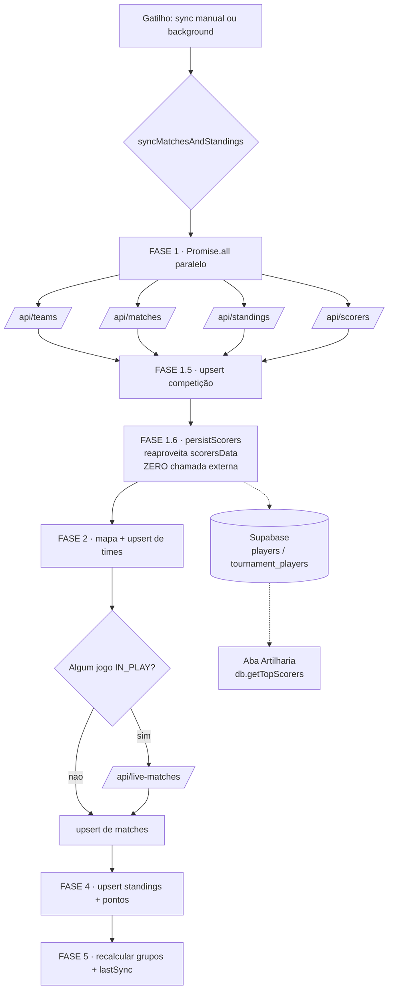

# Chamadas à API Externa — Quais, Quando e Como

Este documento descreve **todas as chamadas a serviços externos** feitas pelo
app, com foco na **Football-Data.org** (placares, classificação, artilheiros e
elencos), incluindo **quando** cada endpoint é chamado e o **fluxo do sync**.

> TL;DR do sync: cada execução de `syncMatchesAndStandings` faz **4 chamadas
> externas em paralelo** (`teams`, `matches`, `standings`, `scorers`) + **1
> condicional** (`live-matches`, só quando há jogo ao vivo). A persistência de
> artilheiros (aba **Artilharia**) **reaproveita** o `scorers` já buscado —
> **zero chamadas extras**.

---

## 1. Arquitetura do proxy (token nunca vai ao frontend)

Todas as chamadas à Football-Data passam por um caminho `/api/*` que injeta o
header `X-Auth-Token` **no servidor**. O token (`FOOTBALL_DATA_TOKEN`) nunca é
exposto ao browser, e o proxy também resolve CORS.

Há **duas implementações do mesmo contrato** `/api/*`, dependendo do ambiente:

| Ambiente | Quem serve `/api/*` | Onde |
|----------|--------------------|------|
| **Dev** (`vite`) | Proxy do Vite — reescreve `/api/x` → `https://api.football-data.org/v4/...` e injeta o token | `vite.config.ts` |
| **Produção** (Vercel) | Vercel Edge Functions (uma por endpoint) | `api/*.ts` |

Regra de ouro (ver `docs/conventions`): **o frontend nunca chama
`api.football-data.org` direto** — sempre `fetch('/api/...')` via
`services/liveScoreService.ts`.

```
Componente / Hook
      │  fetch('/api/scorers?competition=WC&season=2026')
      ▼
services/liveScoreService.ts   (fetchCompetitionScorers, etc.)
      │
      ▼
/api/*  ──► [DEV] Vite proxy            ──┐
         └► [PROD] Vercel Edge Function ──┤  injeta X-Auth-Token
                                          ▼
                       https://api.football-data.org/v4/...
```

---

## 2. Catálogo de endpoints (Football-Data)

Todos os endpoints externos seguem o padrão **"tenta com `season`, faz fallback
sem `season`"** em caso de `404/403` (a temporada do ano corrente pode não
existir ainda na API).

| Caminho frontend | Endpoint Football-Data (`/v4`) | Função em `liveScoreService.ts` | Para quê |
|---|---|---|---|
| `/api/teams` | `GET /competitions/{code}/teams` | `fetchCompetitionTeams` | Times + **elencos** (squad → tabela `players`) |
| `/api/matches` | `GET /competitions/{code}/matches` | `fetchExternalMatches` | Jogos, placares, status, fases |
| `/api/standings` | `GET /competitions/{code}/standings` | `fetchExternalStandings` | Classificação (tabela de grupos) |
| `/api/scorers` | `GET /competitions/{code}/scorers` | `fetchCompetitionScorers` | **Artilheiros** (gols/assist/pênaltis) |
| `/api/live-matches` | `GET /matches?status=IN_PLAY` | `fetchLiveMatchMinutes` | **Minuto** dos jogos ao vivo (único endpoint que traz `minute`) |
| `/api/competitions` | `GET /competitions` | `fetchExternalCompetitions` | Lista de competições (setup admin) |

---

## 3. Quando cada endpoint é chamado (matriz de gatilhos)

| Gatilho | Quem dispara | Endpoints chamados |
|---|---|---|
| **Sync manual** (botão "Sincronizar" / Admin) | Admin | `teams` + `matches` + `standings` + `scorers` (paralelo) e `live-matches` (se houver jogo ao vivo) |
| **Sync automático / background** | Qualquer usuário logado (via `useBackgroundSync`, intervalo `sync_interval_ms`, default 5 min) | Idêntico ao manual |
| **Bootstrap de competição** (criar grupo de uma nova competição) | Admin | Idêntico ao sync (chama `syncMatchesAndStandings`) |
| **"Sync Players"** (botão no Admin) | Admin | Apenas `teams` (elencos → `players`) |
| **Carregar lista de competições** (tela admin) | Admin | `competitions` |
| **Polling de UI** (`usePollingRefresh`, 15 s) | Usuário logado | **Nenhuma chamada externa** — apenas `refetch` do Supabase |

> **Importante:** o `usePollingRefresh` (15 s) **não** chama a API externa — ele
> só relê o Supabase. Quem chama a Football-Data é o **background sync**
> (`useBackgroundSync`), no intervalo `sync_interval_ms` (default **5 min**),
> e somente quando o `lastSync` da competição expirou.

### Onde fica cada gatilho no código

- `hooks/useSyncSystem.ts` → `syncMatchesAndStandings` (pipeline principal)
- `hooks/useBackgroundSync.ts` → agenda o sync passivo
- `hooks/usePlayerSync.ts` → `syncSquads` (elencos) e `syncScorers` (manual)
- `components/AdminDashboard.tsx` → botões manuais + `fetchExternalCompetitions`

---

## 4. Sequência de chamadas dentro de UM sync

O pipeline `syncMatchesAndStandings(code)` executa nesta ordem:

```
FASE 1   ── Promise.all (PARALELO, 4 chamadas externas) ─────────────
            ├─ /api/teams       (fetchCompetitionTeams)
            ├─ /api/matches     (fetchExternalMatches)
            ├─ /api/standings   (fetchExternalStandings)
            └─ /api/scorers     (fetchCompetitionScorers)

FASE 1.5 ── Upsert da competição (Supabase)
            └─ extrai topScorerName/topScorerGoals do `scorersData`

FASE 1.6 ── Persistir artilheiros (Supabase)   ★ NÃO chama a API externa
            └─ persistScorers(code, scorersData)  → players + tournament_players
               (reaproveita o scorersData da FASE 1; alimenta a aba Artilharia)

FASE 2   ── Mapa de times + upsert de times novos/atualizados (Supabase)

FASE 3   ── Diff de jogos
            └─ /api/live-matches (CONDICIONAL) ── só se algum jogo é IN_PLAY/PAUSED
            └─ upsert de matches (Supabase)

FASE 4   ── Cálculo de pontos + upsert de standings (Supabase)

FASE 5   ── Recalcular user_groups + atualizar lastSync (Supabase)
```

**Total de chamadas externas por sync:** **4** (sempre) **+ 1** (`live-matches`,
só com jogo ao vivo). A FASE 1.6 (artilheiros) custa **0** chamadas externas —
esse foi exatamente o ganho da última alteração.

### Fluxo (Mermaid)



---

## 5. Persistência de artilheiros (detalhe da FASE 1.6)

- `persistScorers(competitionCode, scorersData)` é uma função **de módulo**
  (não-hook) exportada de `hooks/usePlayerSync.ts`.
- É reutilizada por **dois** caminhos, sem duplicar lógica de upsert:
  1. `useSyncSystem` (FASE 1.6) — usa o `scorersData` já buscado → **sem chamada extra**.
  2. `usePlayerSync.syncScorers` (botão manual) — aí sim chama `/api/scorers` ele mesmo.
- Escreve em `players` (identidade, `onConflict externalPlayerId`) e
  `tournament_players` (`onConflict playerId,competitionCode`).
- **Gating:** `canWriteData` (admin) **ou** `isBackgroundSync` (usuário comum).
  O RLS (migração `0020`) permite `INSERT`/`UPDATE` em `v2_players` /
  `v2_tournament_players` para qualquer usuário `authenticated`, então o
  background sync de usuários comuns também grava artilheiros.
- É **não-fatal**: envolto em `try/catch` — uma falha aqui não quebra o sync de
  jogos/classificação.

---

## 6. Rate limiting

- A Football-Data (plano free) limita requisições por minuto. `fetchExternalMatches`
  trata `429` lançando `RATE_LIMIT_<segundos>` (lê `retry-after` ou a mensagem).
- Como cada sync custa 4–5 chamadas, **reduzir a frequência** do background sync
  (`sync_interval_ms`) é a principal alavanca para evitar `429`.
- `teams` e `scorers` mudam pouco minuto-a-minuto; se um dia for preciso aliviar
  a API, são os melhores candidatos a uma cadência mais lenta que os placares.

---

## 7. Outras integrações externas (fora do sync)

| Serviço | Caminho | Quando | Observação |
|---|---|---|---|
| **Google Gemini** | `/api/gemini-prediction` | Previsões assistidas por IA | `services/geminiService.ts` |
| **Supabase Auth** | `/api/supabase-signup` | Cadastro de usuário | Proxy de signup |
| **Supabase** (DB/Realtime/Auth) | client SDK | Leituras/escritas e Realtime | `services/supabase.ts` — **não** é Football-Data |

### Não é chamada externa (apesar do nome)

- `data/team-ranking.json` — arquivo **estático bundlado**. Lido por
  `getWcRankingMap` (no sync) e por `syncTeamRankings` (botão admin). É um
  `fetch` de URL **local**, não da rede externa.

### Legado / não conectado

- `api/api-football-live.ts` — proxy para **api-football.com** (`/fixtures?live=all`),
  um provedor **alternativo**. Atualmente **não está conectado** a nenhum fluxo do
  app (somente o arquivo em si). Mantido como referência.

---

_Última atualização: 2026-06-06. Ver também `docs/features/sync-system.md` e
`docs/architecture/integrations.md`._
