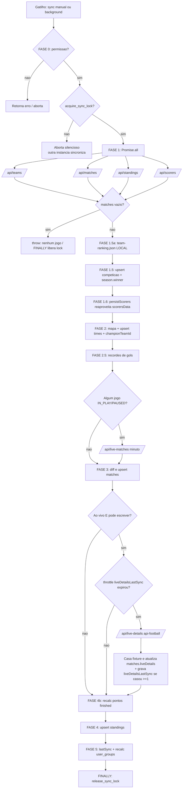
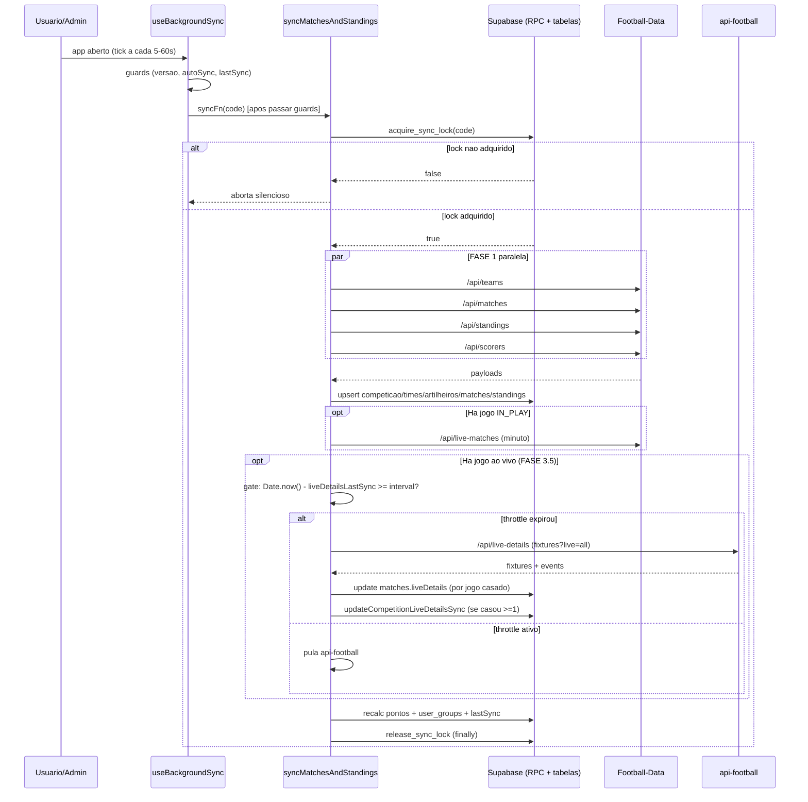

# Fluxo de Sync — End-to-End (Football-Data + api-football)

> **Escopo.** Documenta **todo** o caminho do sync: o que dispara, quais APIs e
> endpoints são chamados, em que ordem, com quais **condições de parada/guarda**,
> e como o **minuto-a-minuto** (api-football / api-sports) se encaixa.
>
> **Fonte da verdade:** `hooks/useSyncSystem.ts` (`syncMatchesAndStandings`),
> `hooks/useBackgroundSync.ts`, `services/liveScoreService.ts`, `api/*.ts`,
> migrations `0031`–`0033`.
>
> _Última atualização: 2026-06-16._ Complementa `docs/architecture/external-api-calls.md`.
> Corrigido: a FASE 3.5 usa **gate de throttle simples** (`liveDetailsLastSync`),
> não lock atômico — o `acquire_live_details_lock` (migration `0033`) foi revertido
> em `5711779` e está órfão.

---

## 1. Visão geral em uma frase

Um **gatilho** (admin ou background sync) chama `syncMatchesAndStandings(code)`.
O pipeline adquire um **lock distribuído**, busca **4 endpoints da Football-Data
em paralelo**, grava tudo no Supabase fase a fase e — **se houver jogo ao vivo** —
passa por um **gate de throttle simples** (`liveDetailsLastSync`) e chama a
**api-football** (`/api/live-details`) para o minuto-a-minuto cosmético. No fim,
recalcula pontos/ranking e libera o lock.

> **Atenção (estado atual do código):** a FASE 3.5 **não usa lock próprio**. O
> commit `a92a0aa` chegou a introduzir um lock atômico (`acquire_live_details_lock`,
> migration `0033`), mas o commit `5711779` **reverteu** isso em favor de um **gate
> de throttle simples** dentro do lock principal — já que o `acquire_sync_lock`
> serializa o pipeline inteiro por competição, não há corrida a proteger. A RPC da
> migration `0033` permanece **órfã** (não chamada). Este documento já reflete o
> gate simples; trechos legados que mencionavam o lock foram corrigidos.

**Dois provedores externos, com papéis distintos:**

| Provedor | Endpoint base | Papel | Entra em pontuação? |
|---|---|---|---|
| **football-data.org** (`/v4`) | `api.football-data.org` | Placar **oficial**, status, fases, classificação, artilheiros, elencos | ✅ **Sim** (fonte de verdade dos resultados) |
| **api-football / api-sports** (`v3`) | `v3.football.api-sports.io` | **Minuto-a-minuto**: relógio, eventos (gols/cartões/subs), árbitro, estádio | ❌ **Não** — puramente cosmético para a UI ao vivo |

---

## 2. Gatilhos (quem chama o sync)

| Gatilho | Quem | Onde | Frequência |
|---|---|---|---|
| **Sync manual** | Admin (botão no Painel) | `AdminDashboard.tsx` → `syncMatchesAndStandings` | Sob demanda |
| **Background sync** | Qualquer usuário logado | `useBackgroundSync.ts` (`tick`) | A cada `checkInterval` (5s–60s), mas só **executa** se `lastSync` expirou |
| **Bootstrap de competição** | Admin (cria grupo novo) | delega ao mesmo pipeline | Sob demanda |

> O `useBackgroundSync` roda para **todos**, mas o **lock distribuído** garante que
> apenas **um cliente** efetivamente sincroniza por janela.

### Condições de parada do `useBackgroundSync` (antes de chamar o pipeline)

Avaliadas em ordem dentro de `tick()` (`useBackgroundSync.ts`):

1. **Supabase desabilitado** → aborta.
2. **Erro ao carregar `system_config`** → aborta.
3. **Versão do app desatualizada** (`app_versions[DEPLOY_TARGET]` ≠ versão local) →
   bloqueia sync e dispara `onVersionOutdated`.
4. **Nenhum grupo ativo** (`activeCodes` vazio) → retorna.
5. **Sync já em andamento neste cliente** (`syncLockRef`) → pula o código.
6. **Auto-sync desativado para a competição** (`autoSyncEnabled === false`) → pula.
7. **`lastSync` ainda dentro do intervalo** (`elapsed < sync_interval_ms`) → pula
   (este é o gate principal de cadência, default **5 min**).

Só se **todas** passarem é que `syncFn(code)` → `syncMatchesAndStandings` é chamado.

---

## 3. Catálogo de endpoints

Todos via proxy `/api/*` (token injetado server-side; nunca vai ao browser).

### Football-Data (`api.football-data.org/v4`)

| Proxy | Endpoint real | Função (`liveScoreService.ts`) | Quando |
|---|---|---|---|
| `/api/teams` | `GET /competitions/{code}/teams` | `fetchCompetitionTeams` | Toda FASE 1 |
| `/api/matches` | `GET /competitions/{code}/matches` | `fetchExternalMatches` | Toda FASE 1 |
| `/api/standings` | `GET /competitions/{code}/standings` | `fetchExternalStandings` | Toda FASE 1 |
| `/api/scorers` | `GET /competitions/{code}/scorers` | `fetchCompetitionScorers` | Toda FASE 1 |
| `/api/live-matches` | `GET /matches?status=IN_PLAY` | `fetchLiveMatchMinutes` | FASE 3, **só** se há jogo `IN_PLAY/PAUSED` (traz o `minute`) |
| `/api/competitions` | `GET /competitions` | `fetchExternalCompetitions` | Setup admin (fora do loop) |

### api-football / api-sports (`v3.football.api-sports.io`)

| Proxy | Endpoint real | Função | Quando |
|---|---|---|---|
| `/api/live-details` | `GET /fixtures?live=all&league=1` | `fetchLiveMatchDetails` | FASE 3.5, **só** se há jogo ao vivo **e** já passou o intervalo desde `liveDetailsLastSync` (gate de throttle simples, default 50s) |

> `api/api-football-live.ts` (`/fixtures?live=all`) é um proxy **alternativo/legado**
> da mesma api-sports, **não** ligado ao pipeline. O endpoint em uso é `/api/live-details`.

> **Local, sem rede externa:** `data/team-ranking.json` (FIFA ranking) é bundlado e
> lido por `getWcRankingMap`, cacheado em ref. Custo zero de cota.

---

## 4. Pipeline fase a fase

Legenda: **EXT** = chamada externa · **W/R** = escrita/leitura Supabase.

| Fase | O quê | EXT | Supabase | Condição de parada / guarda |
|---|---|:--:|---|---|
| **0 · Guards + Lock** | Permissão (`canWriteData` OU `isBackgroundSync`); lock em memória (`syncingCompetitionsRef`); **lock distribuído** `acquire_sync_lock` | — | R/W RPC | Sem permissão → retorna erro. Lock em memória ocupado → "sync em andamento". **Lock distribuído não adquirido → aborta silencioso** (outra instância sincroniza) |
| **1 · Fetch paralelo** | `Promise.all`: teams, matches, standings, scorers | **4×** | — | **`matches` vazio → `throw` "Nenhum jogo encontrado"** (aborta o sync) |
| **1.5a · Ranking map** | `getWcRankingMap()` (local, cacheado) | — (local) | — | — |
| **1.5 · Upsert competição** | Metadados + `topScorerName/Goals`; deriva `season.winner` | — | W `competitions` | — |
| **1.6 · Persistir artilheiros** | `persistScorers` (reaproveita `scorersData`) | — | W `players`, `tournament_players` | Gateado por `canWriteData \|\| isBackgroundSync`; **não-fatal** (try/catch) |
| **2 · Mapa de times** | ext→interno; adota órfãos; upsert novos; resolve `championTeamId` | — | W `teams`, `competitions` | — |
| **2.5 · Recordes de gols** | "mais gols" / "mais sofridos" num jogo | — | W `competitions` | — |
| **3 · Diff de jogos** | Compara API vs banco; upsert dos que mudaram | **0–1** (`live-matches`) | W `matches` | Pula jogo se: **`syncLocked`** (admin travou); **override admin < 2 min**; **`isStaleApiData`** (IN_PLAY com `lastUpdated` > 30 min e não confirmado ao vivo). Upsert só se **`hasChanged`** |
| **3.5 · Live details** | api-football minuto-a-minuto; merge no `liveDetails` de cada jogo casado | **0–1** (`live-details`) | R/W `competitions.liveDetailsLastSync` + W `matches.liveDetails` | **Só roda se há jogo ao vivo E (`canWriteData \|\| isBackgroundSync`).** **Só chama a API se `Date.now() - liveDetailsLastSync >= live_details_interval_ms`** (gate simples dentro do lock principal, default **50s**). Após casar ≥1 jogo, grava `liveDetailsLastSync = NOW()` via `updateCompetitionLiveDetailsSync`. Erros são não-fatais (dados cosméticos) |
| **4b · Pontos** | `batchProcessPointsForMatches` — **todos** os `FINISHED` (idempotente) | — | R/W `predictions` | Idempotente: só `upsert` se `points` mudou |
| **4 · Standings** | Upsert classificação (dedup `teamId\|code`, só `type=TOTAL`) | — | W `team_standings` | — |
| **5 · Fechamento** | `lastSync`; recalc `user_groups`; **release lock** (no `finally`) | — | W `competitions`, `user_groups` | `lastSync` só grava se `combinedSuccess`. **Lock é liberado sempre** (finally), mesmo em erro |

**Custo externo por sync:** **4 fixas** + **0–1** (`live-matches`) + **0–1**
(`live-details`) = **4 a 6** chamadas, conforme houver jogo ao vivo e o gate de
throttle de live-details permitir.

---

## 5. Anti-concorrência: UM lock + um gate de throttle

Duas abas/usuários podem disparar sync ao mesmo tempo. Um **lock atômico** no
Postgres serializa o trabalho caro; a chamada à api-football é controlada por um
**gate de throttle simples** (não-atômico) que roda **dentro** desse lock:

| Mecanismo | RPC / coluna | Protege | Migration |
|---|---|---|---|
| **Sync lock** (atômico) | `acquire_sync_lock` / `competitions.sync_locked_at` | O **pipeline inteiro** — só um cliente sincroniza por vez, por competição | (sync base) |
| **Gate de live-details** (throttle simples) | leitura de `competitions.liveDetailsLastSync` + `updateCompetitionLiveDetailsSync` | Frequência da **chamada à api-football** (cota). `if (Date.now() - liveDetailsLastSync >= interval)` | coluna em `0031` |

> **Por que o gate simples basta:** como o `acquire_sync_lock` já serializa o
> pipeline por competição, **só uma instância** chega à FASE 3.5 por vez — não há
> corrida no read-then-write do `liveDetailsLastSync`. Por isso o lock atômico
> dedicado (`acquire_live_details_lock`, migration `0033`) foi **revertido**
> (`5711779`) e a RPC ficou órfã.
>
> O gate grava `liveDetailsLastSync = NOW()` **após** casar ≥1 jogo (não antes),
> e **não** atualiza o timestamp se o payload veio vazio/`elapsed` inválido — para
> não bloquear o throttle por causa de uma resposta ruim da api-sports. Intervalo
> configurável em `system_config.live_details_interval_ms` (default **50s**).

---

## 6. Diagrama — fluxograma do pipeline



---

## 7. Diagrama — sequência (quem fala com quem)



---

## 8. FASE 3.5 em detalhe (minuto-a-minuto)

1. **Gate de entrada:** `hasLiveMatches && (canWriteData || isBackgroundSync)`.
2. **Gate de throttle (simples, não-atômico):** lê `competition.liveDetailsLastSync`
   e calcula `elapsedMs = Date.now() - lastSyncMs`. Só prossegue se
   `elapsedMs >= live_details_interval_ms` (default 50s). Caso contrário → **pula a
   api-football** e segue o pipeline. Seguro sem atomicidade porque o
   `acquire_sync_lock` já serializa o pipeline por competição.
3. **Fetch:** `fetchLiveMatchDetails()` → `/api/live-details` → `fixtures?live=all&league=1`.
   - Qualquer erro retorna `[]` (cosmético, não quebra o sync).
4. **Casamento** (`matchLiveFixtureToInternal`): por `apiSportsFixtureId` já persistido;
   senão por **mesmo dia UTC + nomes de times** (com aliases; aceita home/away trocados).
5. **Estatísticas (piggyback):** para os fixtures casados, busca em `Promise.all`
   as stats via `fetchLiveStats(fixtureId, homeApiId, awayApiId)` → `/api/live-stats`
   → `fixtures/statistics?fixture=`. Não-fatal (retorna `null` em erro/vazio).
6. **Persistência:** `updateMatch(id, { liveDetails: fx.details, ...(stats ? { liveStats } : {}) })`
   por jogo casado — **um** write (1 evento realtime). A chave `liveStats` só entra
   quando há conteúdo (não sobrescreve stats boas com vazio). Ver `docs/features/live-stats.md`.
7. **Fecha o gate:** se casou ≥1 jogo **e** `elapsedMs > 0`, grava
   `liveDetailsLastSync = NOW()` (`updateCompetitionLiveDetailsSync`). Se o payload
   veio vazio/inválido, **não** grava — para não travar o throttle por uma resposta ruim.

> ⚠️ **Ponto de atenção conhecido:** a persistência hoje **substitui** o
> `liveDetails` inteiro. Se um tick do `fixtures?live=all` vier com `events: []`
> (comportamento transitório da api-sports em transições de status), os eventos já
> salvos são **sobrescritos por vazio**. Eventos ao vivo são monotônicos — o ideal
> é fazer **merge/anti-regressão** dos `events` em vez de replace cego. Ver análise
> na conversa de investigação / `services/liveScoreService.ts`.

---

## 9. Condições de parada — resumo

| Camada | Para/pula quando… |
|---|---|
| `useBackgroundSync` | Supabase off · erro no config · versão desatualizada · sem grupos · sync local em andamento · autoSync off · `lastSync` dentro do intervalo |
| FASE 0 | sem permissão · lock em memória ocupado · **lock distribuído não adquirido** |
| FASE 1 | **`matches` vazio → throw** |
| FASE 3 (por jogo) | `syncLocked` · override admin < 2 min · `isStaleApiData` · `hasChanged === false` |
| FASE 3.5 | sem jogo ao vivo · sem permissão de escrita · **throttle ativo** (`elapsed < live_details_interval_ms`) · erro na api-football (não-fatal) |
| FASE 5 / finally | `lastSync` só com `combinedSuccess`; **lock sempre liberado** |

---

## 10. Referências de código

- `hooks/useSyncSystem.ts` — pipeline (`syncMatchesAndStandings`), fases 0–5 + 3.5
- `hooks/useBackgroundSync.ts` — gatilho passivo + guards de cadência
- `services/liveScoreService.ts` — fetchers, `parseApiSportsFixtures`, casamento
- `contexts/DatabaseContext.tsx` — `acquireSyncLock`, `releaseSyncLock`, `updateCompetitionLiveDetailsSync`, `updateMatch` (obs.: `acquireLiveDetailsLock` **não** existe no contexto — lock revertido)
- `api/matches.ts`, `api/live-matches.ts`, `api/live-details.ts` — proxies
- `database/migrations/0031`–`0033` — coluna `liveDetails` + `liveDetailsLastSync` (0031), intervalo configurável (0032), lock atômico **órfão/revertido** (0033)
```
